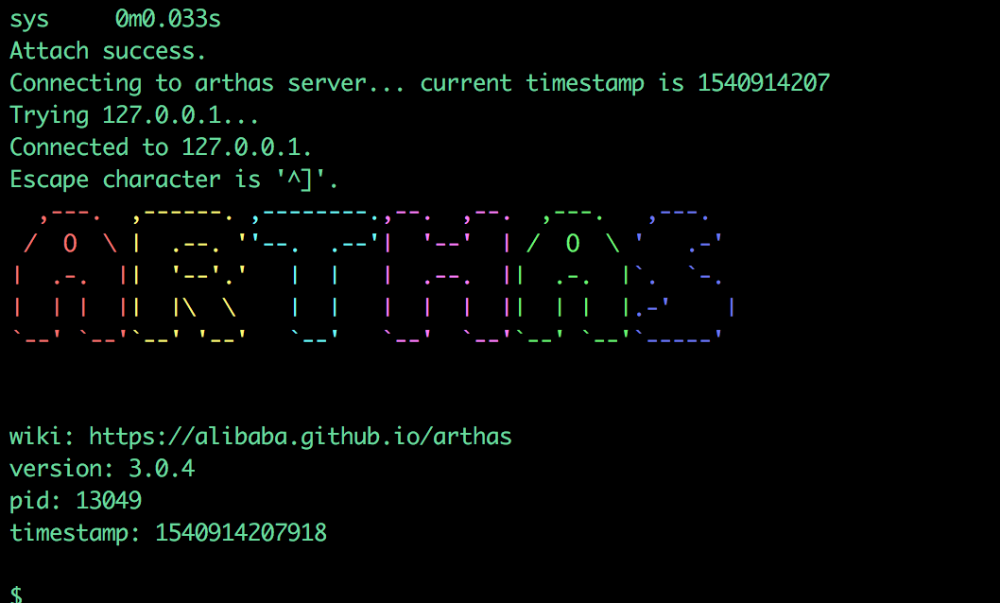

##  Arthas第一篇之初步脚本分析

@(https://github.com/edagarli/JAVAZeroToOne)[工具篇|arthas]

**Arthas**这里不多介绍简介了，具体看[Github][1]上详细的介绍。简单来说**Arthas**就是Java诊断工具，可以方便线上问题的定位和诊断。

声明一下，下面我是在centos下操作，但原理是一样的。首先你会通过install.sh脚本（主要通过curl下载）安装得到一个as.sh运行脚本。启动Arthas的话是通过./as.sh来启动的。as.sh里面到底做了什么事情呢？（下面我会边贴部分代码，边说明，这样好对照的讲述，可以的话你们也可以对着源码结合文章一起分析）

1. 首先你会看到一堆字段的声明，脚本版本，下载的lib包目录等

  #### 代码块
  ``` sh
    # current arthas script version
    ARTHAS_SCRIPT_VERSION=3.0.4
    # define arthas's home
    ARTHAS_HOME=${HOME}/.arthas
    # define arthas's lib
    ARTHAS_LIB_DIR=${ARTHAS_HOME}/lib
  ```

2. 执行一些环境的检查。比如是否安装grep，unzip等，接下来执行脚本需要。

  #### 代码块
  ``` sh
      # check curl/grep/awk/telent/unzip command
    if ! [ -x "$(command -v curl)" ]; then
      echo 'Error: curl is not installed.' >&2
      exit 1
    fi
    if ! [ -x "$(command -v grep)" ]; then
      echo 'Error: grep is not installed.' >&2
      exit 1
    fi
    if ! [ -x "$(command -v awk)" ]; then
      echo 'Error: awk is not installed.' >&2
      exit 1
    fi
    if ! [ -x "$(command -v telnet)" ]; then
      echo 'Error: telnet is not installed.' >&2
      exit 1
    fi
    if ! [ -x "$(command -v unzip)" ]; then
      echo 'Error: unzip is not installed.' >&2
      exit 1
    fi
  ```
3. 进入main方法，开始真正的逻辑了。
   -  1）首先调用check_permission，检查主机上${HOME}路径上是否对当前用户有权限写入。（lib的下载需要写入权限）
   -  2）下一步调用reset_for_env，这个主要还是获取到JAVA_HOME，JAVA_VERSION，最终判断tool.jar是否存在，如果不存在，就无法启动arthas.（因为接下来的需要用到attach实现，这个依赖于tools.jar包）最后提下，这边做了特殊处理，如果是alibaba的opts，重新设置了GBK编码
   #### 代码块
   ``` sh
   # reset CHARSET for alibaba opts, we use GBK
     [[ -x /opt/taobao/java ]] && JVM_OPTS="-Dinput.encoding=GBK ${JVM_OPTS} "
   ```
   - 3）接下来检查执行命令传入的参数parse_arguments，对help，versions等常用命令加以判断，输出对应内容，当然这里也支持脚本BATCH_SCRIPT作为参数输入执行，接下来你应该会看到debug的判断，这里支持debug模式-agentlib:jdwp:transport=dt_socket,server=y,suspend=n,address=8888，其实用过ide debug模式的话一样的道理（这里好像直接debug有点问题，需要debug+pid才行，看[issues][2] , 3.0.5版本应该会修复）;
   然后你会看到下面的代码，获取到关键的ip，以及端口。然后for遍历java进程。等待选择（read choice），你选择了合适的端口,最终拿到了合适的pid（TARGET_PID=`echo ${CANDIDATES[$(($choice-1))]} | cut -d ' ' -f 1`）
   #### 代码块
     ``` sh
     TARGET_PID=$(echo ${1}|awk -F "@"   '{print $1}');
     TARGET_IP=$(echo ${1}|awk -F "@|:" '{print $2}');
     TELNET_PORT=$(echo ${1}|awk -F ":"   '{print $2}');
     HTTP_PORT=$(echo ${1}|awk -F ":"   '{print $3}');
     CANDIDATES=($("${JAVA_HOME}"/bin/jps -l | grep -v sun.tools.jps.Jps | awk '{print $0}'))

        if [ ${#CANDIDATES[@]} -eq 0 ]; then
            echo "Error: no available java process to attach."
            # recover IFS
            IFS=$IFS_backup
            return 1
        fi

        echo "Found existing java process, please choose one and hit RETURN."

        index=0
        suggest=1
        # auto select tomcat/pandora-boot process
        for process in "${CANDIDATES[@]}"; do
            index=$(($index+1))
            if [ $(echo ${process} | grep -c org.apache.catalina.startup.Bootstrap) -eq 1 ] \
                || [ $(echo ${process} | grep -c com.taobao.pandora.boot.loader.SarLauncher) -eq 1 ]
            then
               suggest=${index}
               break
            fi
        done
     ```
   - 4) 是否版本更新的判断（update_if_necessary）,通过curl获取远程的版本，检查本地服务器lib下面有木有这个版本.
    
    比如我服务器下现在是3.0.4的版本,远程最新版本没有的话，那就更新下来zip包，然后用unzip解压（所以之前unzip检查的必要性，好像老版本这块都没检查，当时自己修改了脚本，直接 yum install -y unzip zip安装了）。最后你会看到脚本执行进入的时候有个进度条一样的，其实就是下载。
   - 5）然后是sanity_check，这个主要是判断pid存不存在，当前执行的用户是不是启动这个pid的用户，所以这里需要保证用户一致性。
   - 6）这一步attach_jvm是最重要的啦，attach进程；这里通过maven jar包manifest mainClass指定arthas-core里面的com.taobao.arthas.core.Arthas类
     #### 代码块
     ``` sh
     if [ ${TARGET_IP} = ${DEFAULT_TARGET_IP} ]; then
      "${JAVA_HOME}"/bin/java \
          ${opts}  \
          -jar "${arthas_lib_dir}/arthas-core.jar" \
              -pid ${TARGET_PID} \
              -target-ip ${TARGET_IP} \
              -telnet-port ${TELNET_PORT} \
              -http-port ${HTTP_PORT} \
              -core "${arthas_lib_dir}/arthas-core.jar" \
              -agent "${arthas_lib_dir}/arthas-agent.jar"
     fi
     ```
   - 7) Arthas类做了什么事情呢？如下：主要是利用了tool.jar这个包中的VirtualMachine.attach(pid)来实现，同时上面加载了自定义的agent代理,见下面 virtualMachine.loadAgent（agent后面会详细说明），这样就建立了连接。（如果感兴趣的话，可以去详细了解下attach底层技术JVMTI）
   #### 代码块
   ``` java
     private void attachAgent(Configure configure) throws Exception {
            VirtualMachineDescriptor virtualMachineDescriptor = null;
            for (VirtualMachineDescriptor descriptor : VirtualMachine.list()) {
                String pid = descriptor.id();
                if (pid.equals(Integer.toString(configure.getJavaPid()))) {
                    virtualMachineDescriptor = descriptor;
                }
            }
            VirtualMachine virtualMachine = null;
            try {
                if (null == virtualMachineDescriptor) { // 使用 attach(String pid) 这种方式
                    virtualMachine = VirtualMachine.attach("" + configure.getJavaPid());
                } else {
                    virtualMachine = VirtualMachine.attach(virtualMachineDescriptor);
                }

                Properties targetSystemProperties = virtualMachine.getSystemProperties();
                String targetJavaVersion = targetSystemProperties.getProperty("java.specification.version");
                String currentJavaVersion = System.getProperty("java.specification.version");
                if (targetJavaVersion != null && currentJavaVersion != null) {
                    if (!targetJavaVersion.equals(currentJavaVersion)) {
                        AnsiLog.warn("Current VM java version: {} do not match target VM java version: {}, attach may fail.",
                                        currentJavaVersion, targetJavaVersion);
                        AnsiLog.warn("Target VM JAVA_HOME is {}, try to set the same JAVA_HOME.",
                                        targetSystemProperties.getProperty("java.home"));
                    }
                }

                virtualMachine.loadAgent(configure.getArthasAgent(),
                                configure.getArthasCore() + ";" + configure.toString());
            } finally {
                if (null != virtualMachine) {
                    virtualMachine.detach();
                }
            }
        }
    ```

   - 8) Attach success后，调用active_console，主要进行telnet通讯。
       telnet ${TARGET_IP} ${TELNET_PORT}，最后你会看到如下图: 


## 问题

   可能大家中间会遇到illegal env问题。见这个[issue][3].
   如果你很多机器要安装，不想老是搞环境问题，可以在as.sh脚本加上下面的。具体openjdk版本见issue怎么去查找然后替换。
   #### 代码块
   ``` sh
   #!/usr/bin/env bash
     export JAVA_HOME=/usr/lib/jvm/java-1.8.0-openjdk-1.8.0.161-0.b14.el7_4.x86_64
   ```

## 最后

   上面只是我研究过程中，顺带记录下来的，有任何问题可以讨论指教下。接下来继续第二篇研究吧。


  [1]: https://github.com/alibaba/arthas
  [2]: https://github.com/alibaba/arthas/issues/128
  [3]: https://github.com/alibaba/arthas/issues/70
